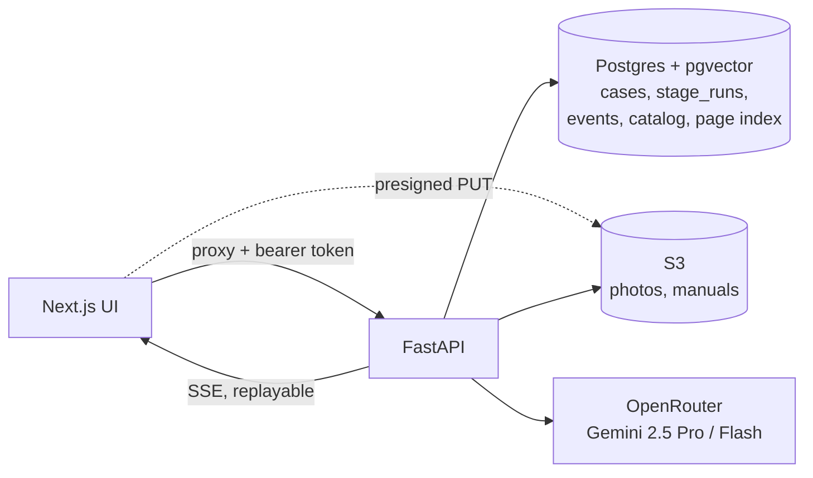

# Opera AI

**Photograph a broken appliance, describe what it's doing, and get a diagnosis
grounded in the manufacturer's own service manual, where every claim cites the
manual page it came from.**

Opera AI reads the appliance's data plate to identify the exact model, finds
that model's service manual, and reasons over it, including the flowcharts
and status-code tables that exist only as images. It returns ranked causes,
the parts involved and what to do next. If the repair isn't safe for a
homeowner, it says so, quotes the manual's own words, and gives the user a
brief to hand to a technician.

Started at HackCanada 2026. The backend has since been rewritten in FastAPI,
with a staged job runner, citation verification and an evaluation harness.

---

## Example

Input: two photos of a Carrier 59SC6A gas furnace (the data plate and the
interior), plus *"Igniter glows but no flame. After several attempts it stops
and the board light blinks 3 short 4 long."*

Output, from a live run:

| | |
|---|---|
| **Identified** | Carrier 59SC6A060M17--16, validated against the catalog built from the manual |
| **Safety verdict** | Technician. *"Only trained and qualified personnel should install, repair, or service heating equipment…"* (manual p.4) |
| **Most likely cause** | Inadequate gas supply to the burners (manual pp. 24, 58, 72), status code 34 |
| **Parts** | Gas valve (pp. 24, 58, 69, 72), circuit board (p. 72). *Part numbers are not printed in this manual*, so none are shown |
| **For the homeowner** | Filter, thermostat, breaker and gas-shutoff checks, the only work the manual allows an untrained person to do |
| **For the technician** | The code, the inlet gas pressure range to measure, and the pages to read |

---

## Architecture



Each case runs as a pipeline of persisted stages:

```
identify ──▶ safety gate ──▶ [retrieve] ──▶ diagnose ──▶ verify citations ──┬──▶ parts
(Flash,      (rule table,     (optional,     (Pro, the      (text match on    └──▶ instructions
 catalog      no model)        hybrid         manual as      the cited pages)       (run in parallel)
 check)                        search)        rendered pages)
```

| Stage | What it does |
|---|---|
| **identify** | Reads the data plate with a vision model, then checks the model number against a catalog decoded from the manual's nomenclature table. A misread (O for 0, I for 1) lowers the identity confidence instead of being trusted |
| **safety gate** | Decides whether this is DIY or technician work from a fixed table of hazard classes (gas, sealed refrigerant, combustion venting…). No model involved. It cites the manufacturer's service-scope statement, extracted when the manual is ingested |
| **retrieve** *(behind a flag)* | Exact status-code lookup plus hybrid search: Postgres full-text and pgvector results merged with Reciprocal Rank Fusion in a single SQL function. Narrows the manual to its top-k pages |
| **diagnose** | Gemini 2.5 Pro reads the manual as **rendered pages**, alongside the symptom and photos, and returns ranked causes, each with page citations and verbatim quotes. It may abstain or ask a question |
| **verify** | Checks each quoted phrase against the text of the page it cites. Each quote gets one of three verdicts: `VERIFIED`, `NOT_FOUND`, or `UNVERIFIABLE` for pages that are diagrams |
| **parts** | Names the components involved the way the manual does. Part numbers are kept only if they appear in the manual's text. Purchase links are built in code, never taken from the model |
| **instruct** | Step-by-step instructions for DIY work. For technician work, the schema has no field for repair steps, so the model can't produce them. It produces a handoff brief and the manual-sanctioned owner checks instead |

---

## Engineering decisions

**The manual goes to the model as pages, not extracted text.** In service
manuals, the troubleshooting flowcharts and status-code tables are images: the
Carrier manual's fault-code flowchart on p.72 has about 250 characters of
extractable text. OpenRouter extracts PDF text by default, which throws those
pages away, so every PDF request uses the provider's native renderer instead.
I checked this against a PDF with no extractable text at all: the model still
read values that existed only as pixels.

**Safety is a lookup table, not a model judgment.** A model asked "is this safe
for a homeowner?" will sometimes say yes about a gas furnace. The verdict comes
from hazard classes recorded at ingestion, and its justification is the
manufacturer's own scope statement, quoted with its page number.

**A plausible fabrication gets checked by code.** Page numbers, part numbers
and URLs are all easy for a model to make up and impossible for a user to spot.
Each has a mechanical check: quotes are matched against the cited page's text,
part numbers against the manual's text, and URLs are built in code.

**A stage run is stored before anything reads it.** One `stage_runs` table does
four jobs:
- the work queue;
- the lease, with `claimed_at` and reclaim of stale leases, so a worker that
  crashes doesn't leave a case stuck;
- the idempotency key, a sha256 of the stage's real inputs;
- the result store.

Every step is also appended to `pipeline_events`. A browser that reconnects
replays the stored events instead of re-running a paid, 90-second model call.

**The frontend can't hang.** The UI was written against an earlier backend and
waits indefinitely on two specific events. A translation layer maps the
pipeline's events onto them and guarantees both fire, even in degraded form,
whatever fails upstream. A test checks that property against a model of the
frontend's state machine, and a Playwright test drives the real UI in Chrome.
That Playwright test caught a React StrictMode bug that had left the page stuck
on phase 1.

**Uploads never pass through the API server.** The browser uploads straight to
S3 with a presigned PUT. The API then checks the file's MIME type against its
actual signature bytes, records a checksum, and enforces a per-case quota. An
upload that is registered but never completed still counts against the quota.

---

## Evaluation

Speed versus accuracy is measured, not assumed. There are 16 test cases (a
symptom, sometimes a displayed code, and the manual pages a technician would
need), and each diagnosis setup ran on all of them, in shuffled order so
provider slowdowns hit every setup equally.

| Setup | Median latency | p90 | Cites an expected page | Top cause cites one |
|---|---|---|---|---|
| **Full manual, Gemini 2.5 Pro** *(default)* | 80 s | 124 s | **94%** | **81%** |
| Manual passed by URL | 70 s | 123 s | 87% | 80% |
| Top-k retrieved pages, Pro | 41 s | 264 s | 75% | 69% |
| Top-k retrieved pages, Flash | **9 s** | **12 s** | 69% | 63% |

Every setup identified the displayed status code on all 7 cases that had one.
Retrieval alone scores hit@5 = 0.94 and recall@8 = 0.79, and a search takes
about 400 ms.

**What that means:** diagnosing from retrieved pages halves the median time,
and on every case I reviewed by hand it reached the same diagnosis as the full
manual. It cites less well only because the retriever sometimes misses a
supporting page. Flash is 9× faster but gave wrong or vague answers on 2–3 of
the 16 cases. So the full manual with Pro stays the default, and retrieval
ships behind a flag until its recall improves. Other findings from these runs:
- A reasoning-effort setting passed through OpenRouter wasn't reliably honored.
- None of the 96 diagnoses was cut off by the output-token limit. The few
  failures were provider errors.

Two changes that cut latency without affecting accuracy are already in:
- The manual's page text is stored in S3, so a cold start takes 0.13 s instead
  of 24 s of blocking extraction.
- Parts and instructions run concurrently.

Raw per-case results are in [backend/eval/results/](backend/eval/results/),
and the harness is [backend/app/eval/](backend/app/eval/).

---

## Testing

The backend has 145 tests: stage logic, the lease and idempotency behavior of
the runner, upload validation, the frontend event translator and retrieval.
They run offline against recorded golden outputs, so the suite doesn't pay for
model calls. On top of that:

| Command | Checks |
|---|---|
| `python -m tests.smoke` | S3 upload and download, a database round trip and one model call, all real |
| `python -m tests.e2e_frontend` | Every call the browser makes, through the Next.js proxy |
| `python -m tests.browser_e2e` | The real UI in headless Chrome, from upload through to the result screen |
| `python -m app.eval.configs` | The latency and accuracy comparison above |

---

## Running locally

**Prerequisites:**
- Python 3.10+
- Node 18+
- A Postgres database with `pgvector` (Supabase works)
- An S3 bucket
- An [OpenRouter](https://openrouter.ai) key

```bash
# Backend
cd backend
python3 -m venv .venv && source .venv/bin/activate
pip install -r requirements.txt
cp .env.example .env                                  # fill in keys; never commit .env
python -m app.ingestion.cli migrate
python -m app.ingestion.cli add manuals/<manual>.pdf  # one-off per manual
uvicorn app.main:app --reload --port 8000
curl localhost:8000/health                            # shows what is configured and what is reachable

# Frontend
cd hackcanada-next-ui
npm install
# .env.local:  BACKEND_URL=http://localhost:8000
#              BACKEND_API_TOKEN=<same as API_BEARER_TOKEN>
npm run dev                                           # http://localhost:3000
```

The token has no `NEXT_PUBLIC_` prefix, so it stays on the server.

See [backend/README.md](backend/README.md) for the API, configuration flags and
ingestion details.

---

## Repository layout

```
backend/                  FastAPI service
  app/api/                cases, presigned uploads, SSE events, frontend translator
  app/pipeline/           runner, safety gate, citation verifier, stages/
  app/ingestion/          manual ingestion and page index (offline CLI)
  app/core/               Postgres, S3, OpenRouter, PDF and manual caching
  app/eval/               benchmark and config-comparison harnesses
  eval/                   test cases and recorded results
  migrations/             schema, pgvector index, hybrid search function
  tests/                  unit, golden, integration and browser tests
hackcanada-next-ui/       Next.js 16 / React 19 frontend and API proxy
```

## Limitations and next steps

- **One manual ingested so far** (Carrier 59SC6A). Ingestion is generic, but
  the header-stripping pattern in the page index is specific to Carrier.
- **Latency is dominated by one model call.** Diagnosis takes about 80–110 s of
  a 125 s run. The next steps:
  - improve retrieval recall so the 2× faster setup can become the default;
  - stream a Flash preview answer at about 10 s while Pro finishes.
- **The test labels are drafts** and there are 16 cases, so the p90 figures
  are rough.
